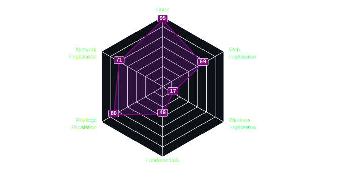

<!--

&nbsp;
<!--💬GREETINGSTITLE / FONTS: https://www.thefancytext.com/ and then paste on 🌐WEBSITE: https://github.com/denvercoder1/readme-typing-svg -->
<!--

-->

<!-- ###########################################  ########################################### -->
<!--📊STATSGRAPH / 🌐WEBSITE: https://github.com/Twilight4/github-readme-stats -->
<!--<h3 align="center"> Github Stats </h3>-->
<!--
            &nbsp; -> space
            &emsp; -> 4x(&nbsp;)
-->

<!--

  

   

-->

<!-- Important Projects -->
<!--<h3 align="center"> Important Projects </h3>-->
<!--## Important Projects

&emsp;&emsp;
-->
<!-- Important Projects -->

<!-- ###########################################  ########################################### -->
<!-- Skills -->
## Skills and Tech

<!-- Skills -->

<!-- Profiles -->
## Capture the Flag (CTF) Profiles

&emsp;&emsp;&emsp;&emsp;&emsp;&emsp;&emsp;&emsp;&emsp;&emsp;

<!-- Profiles -->

<!-- ###########################################  ########################################### -->
<!--About Me -->
<!--## 👨‍💻 [About Me](https://linktr.ee/twilight8)
### I am an offensive security self-taught enthusiast, passionate about cybersecurity and Red Teaming.
- I am specializing in the field of Red Teaming/Network Pentesting within the domain of offensive security which consists of the following assessments types: External/Internal Network (Infrastructure), Active Directory (AD), Social Engineering (SE), Wireless and Physical.
- I am also leveraging my expertise in: Cyber Threat Intelligence (CTI), OSINT Investigations, Black Box Testing, APTs, Linux and Operational Security (OPSEC). 
-->
<!-- About Me -->

<!-- ###########################################  ########################################### -->
<!--&nbsp;

  
  

-->

<!-- ###########################################  ########################################### -->
<!--📈ACTIVITYGRAPH / 🌐WEBSITE: https://github.com/Ashutosh00710/github-readme-activity-graph#customization -->
<!--## 📈 Activity Graph

<a href="https://github.com/Twilight4/github-readme-activity-graph">
            
 -->
 
<!-- ########################################### END ########################################### -->
